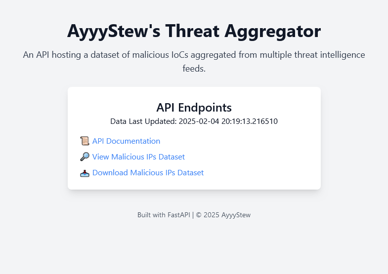

# Threat Aggregator

## Overview

Threat Aggregator is a threat intelligence feed aggregator that collects Malicious Indicators of Compromise (IoCs) from multiple sources, including **Emerging Threats, FeodoTracker, and URLhaus**. It stores this data in a **SQLite database**, making it easy to access and analyze via a FastAPI-powered API.

This project was built as both an **educational tool** to sharpen automation, CI/CD, and programming skills, as well as a practical resource for aggregating threat intelligence.



## Features

- **Automated Data Collection**: Fetches and updates IoCs from multiple threat intelligence sources.
- **FastAPI-Powered API**: Enables easy access to aggregated data via a RESTful API.
- **Search & Filtering**: Retrieve data by date through the API.
- **CI/CD Integration**: Automated testing, containerization, and deployment using GitHub Actions.
- **Containerized Deployment**: Runs seamlessly in a **Docker** container on a **Proxmox** VM.

## Technical Stack

- **Database**: SQLite
- **Backend**: FastAPI (Python 3.8+)
- **Testing**: Pytest
- **CI/CD**: GitHub Actions (for testing, building, and deployment)
- **Containerization**: Docker
- **Virtualization**: Proxmox (LXC/VM-based deployment)

---

## Data Schema

The collected data is structured as follows:

```plaintext
id: UUID4
ipv4: str | None
url: str | None
date: datetime
source: str
original_data: Json | None
abuseIPDBData: Json | None = None
```

_(Thanks Pydantic!)_

---

## API Endpoints

### 1. **Home Page**

- **GET** `/`  
  Returns basic information and system status.

### 2. **Search API**

- **GET** `/view?start_date=YYYY-MM-DD`  
  Returns IoCs collected on or after the specified date.

**Example Request:**

```bash
curl "http://127.0.0.1:8000/view?start_date=2024-02-02&limit=1&page=10"
```

**Example Response:**

```json
[
  {
    "id": "5bae50e0-031c-40f3-8f0f-f127cf687817",
    "ipv4": null,
    "url": "https://raw.githubusercontent.com/moom825/Discord-RAT-2.0/master/Discord%20rat/Resources/Webcam.dll",
    "date": "2025-02-02T12:15:19.604332",
    "source": "https://urlhaus.abuse.ch/downloads/json_online/",
    "original_data": {
      "dateadded": "2024-08-15 16:23:07 UTC",
      "url": "https://raw.githubusercontent.com/moom825/Discord-RAT-2.0/master/Discord%20rat/Resources/Webcam.dll",
      "url_status": "online",
      "last_online": "2025-02-02 13:55:25 UTC",
      "threat": "malware_download",
      "tags": null,
      "urlhaus_link": "https://urlhaus.abuse.ch/url/3108504/",
      "reporter": "abus3reports"
    },
    "abuseIPDBData": null
  }
]
```

### 3. **Download Data**

- **GET** `/download`  
  Download the whole data set as a json file.

---

## Getting Started

### Prerequisites

Ensure you have the following installed:

- **Docker**
- **Python 3.8+**
- **Git**

### Installation & Deployment

1. **Clone the repository**:

   ```bash
   git clone [your-repository-url]
   cd [repository-name]
   ```

2. **Build the Docker container**:

   ```bash
   docker build -t threat-feed-aggregator .
   ```

3. **Run the container**:

   ```bash
   docker run -d -p 80:80 -v ${pwd}/data:/code/app/data threat-aggregator
   ```

   _(Alternatively, use the automated script: `start_container.ps1`.)_

### **Or, use the pre-built container from DockerHub:**

```bash
docker run -d --name threat-aggregator -p 80:80 -v /data/:/code/app/data ayyystew/threat-aggregator:latest
```

---

## Running Tests

Run tests with **pytest**:

```bash
pytest
```

---

## High Level Architecture


---

## CI/CD Pipeline

The GitHub Actions workflow handles:

- Running **automated tests**.
- **Building** the Docker container.
- **Pushing** the container to Docker Hub.
- **Deploying** the container on a **Proxmox VM** via SSH.


---

### Possible Enhancements

_(Future improvements to consider)_:

- Adding **OAuth authentication** for API access.
- Implementing **Grafana dashboards** for visualization.
- Expanding **threat source integrations** beyond the current three.
- Adding scheduled job to add AbuseIPDB data
